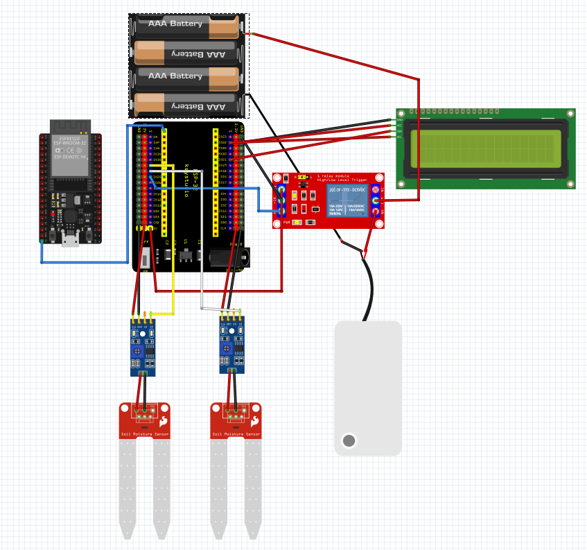

# Documentação da Horta Automática com ESP-32

## 1. Introdução
O projeto de uma horta automatizada, realizado pelo grupo de robótica do Colégio da Polícia Militar da Paraíba, orientado pelos professores Christiano Rodrigues e Wandeilson Ferreira almeja uma intervenção social que preze pela sustentabildade e eficácia na agricultura - inicialmente em escala menor, mas com potencial de extensão elevado, sem custeabilidade elevada. Por sua alta acessibilidade, o uso pode ser feito para vários espectros, como a jardinagem caseira ou um plantio extenso.
Tais virtudes foram atribuídas ao uso da plataforma do ESP-32 para a elaboração do projeto, que permite o uso de conexão Wi-Fi para garantir acesso remoto ao sistema.

## 2. Objetivos do projeto
- Automatizar a Irrigação: O principal objetivo é que o sistema controle a regagem das plantas de forma autônoma, sem depender de intervenção humana. Ele deve ligar a bomba de água automaticamente com base nas necessidades da planta.
- Monitorar a Umidade do Solo: O projeto deve ser capaz de medir a umidade do solo em tempo real. Isso é fundamental para que o sistema saiba quando a irrigação é realmente necessária.
- Garantir o Crescimento Saudável da Planta: O sistema deve manter a umidade do solo em um nível ideal, evitando tanto o ressecamento (falta de água) quanto o encharcamento (excesso de água), o que pode prejudicar a planta. Na maioria dos casos, a intervenção humana na irrigação do solo de uma plantação pode culminar no recessamento ou encharcamento, pela falta de precisão no ato da regagem.
- Otimizar o Uso da Água: Ao irrigar apenas quando necessário, o projeto evita o desperdício de água, tornando o processo mais sustentável e eficiente.
- Facilitar a Manutenção: O sistema deve simplificar a tarefa de cuidar de uma horta, tornando-a acessível para pessoas com pouco tempo ou conhecimento em jardinagem.

## 3. Componentes do Hardware
__ESP-32__
Microcontrolador que atua como a unidade de controle central. Sua principal função é receber as informações dos sensores de umidade, processar esses dados e tomar decisões descritas no código. Além disso, o ESP-32 possui conectividade Wi-Fi e Bluetooth nativa.

__Shield de Expansão__
Funciona como uma placa adaptadora, tornando os pinos do microcontrolador mais acessíveis e organizados, o que elimina a necessidade de protoboards e de muitos cabos. O shield de expansão utilizado no projeto estava contido no kit do ESP-32.

__Sensores de Umidade do Solo__
São colocados no solo e medem a quantidade de água presente. O sensor envia uma leitura elétrica para o ESP-32, que traduz essa informação. Com base nessa leitura, o ESP-32 determina se o solo está seco (precisa de água) ou úmido (não precisa).

__Relé__
O ESP-32 opera com uma tensão baixa (3.3V), enquanto a bomba de água pode precisar de uma tensão maior (como 5V). O relé permite que o ESP-32 controle a bomba de forma segura, agindo como uma ponte entre o circuito de controle de baixa tensão e o circuito de potência de alta tensão. Quando o ESP-32 envia um sinal para o relé, ele "fecha" o circuito, ligando a bomba.

__Bomba de Água 5V__
A bomba de água é responsável pela irrigação. Ela é acionada pelo relé quando o ESP-32 detecta que o solo está seco. A bomba suga a água do reservatório e a direciona para as plantas através de mangueiras com furos dispostos na região em que estiver em contato com o solo, para despejar a água bombeada.

__Material da Fischertechnik (Estrutura)__
Os componentes da Fischertechnik servem para criar a estrutura física da horta, como um chassi ou uma base. Eles são usados para montar e dar suporte aos componentes eletrônicos e às plantas. Isso mantém o projeto organizado, estável e com uma aparência profissional, além de facilitar a montagem e desmontagem. É importante manter uma estrutura desmontável, para fins de transporte e manutenção eficazes.

__LCD (Display de Cristal Líquido)__
O LCD é uma interface de saída de dados. Sua função é exibir informações importantes para o usuário, como a leitura atual de umidade do solo, o estado da bomba (ligada/desligada) ou mensagens de status do sistema. Isso permite que você monitore o projeto presencialmente, sem a necessidade de um computador ou smartphone.

__Módulo de Comunicação (Placa - Sensores de Umidade)__
Esta é a placa de apoio para os sensores de umidade. Sua função é amplificar e converter o sinal do sensor de umidade para um formato que o ESP-32 consiga ler a informação.

__Reservatório de Água__
O reservatório de água é simplesmente o recipiente que armazena a água que será utilizada para a irrigação das plantas. A bomba de água fica imersa nele ou conectada a ele para sugar a água. 

__Fonte de Alimentação (Pilhas)__
As pilhas fornecem a energia elétrica necessária para todo o projeto funcionar. Elas alimentam o ESP-32, a bomba de água, o LCD e os sensores. É fundamental dimensionar a fonte de alimentação corretamente para garantir que todos os componentes recebam a energia adequada para operar.

__Cabos Jumper__
Os cabos jumper são os fios que fazem a conexão elétrica entre todos os componentes, como o ESP-32, o relé, os sensores e o LCD. Eles são essenciais para construir e testar o circuito na protoboard antes da montagem final.

## 4. Diagrama de Conexões
 

<figcaption>Diagrama</figcaption>

    
## 5. Implementação de software
- Código

        #include <Wire.h>
        #include <LiquidCrystal_I2C.h>

        #define col 16
        #define lin  2
        #define ende 0x27

        #define s1 32         
        #define s2 33         
        #define rele 25       

        LiquidCrystal_I2C lcd(ende, col, lin);

        void setup() {
        pinMode(s1, INPUT);
        pinMode(s2, INPUT);
        pinMode(rele, OUTPUT);

        lcd.init();
        lcd.backlight();
        lcd.clear();

        Serial.begin(9600);

        lcd.setCursor(1, 1);
        lcd.print("Iniciando...");
        delay(1000);
        lcd.clear();
        }

        void loop() {
        int s_direito = analogRead(s2);
        int s_esquerdo = analogRead(s1);

        lcd.setCursor(0,0);
        lcd.print("s_direito: ");
        lcd.setCursor(11,0);
        lcd.print(s_direito);
        Serial.println(s_direito);  

        lcd.setCursor(0,1);
        lcd.print("s_esquerdo: ");
        lcd.setCursor(12, 1);
        lcd.print(s_esquerdo);
        Serial.println(s_esquerdo);
        delay(2000);

        if ((s_direito > 2000) || (s_esquerdo > 2000)) { 
            lcd.clear();
            lcd.setCursor(0, 0);
            lcd.print("Solo seco!");
            lcd.setCursor(0, 1);
            Serial.println("Lig. a bomba");
            digitalWrite(rele, HIGH);
            delay(5000);
            
            lcd.clear();
            lcd.setCursor(0, 0);
            lcd.println("Desl. a bomba");
            digitalWrite(rele, LOW);
            delay(5000);
            lcd.clear();
        } else {
            lcd.clear();
            lcd.setCursor(0, 0);
            lcd.print("Solo umido :)");
            delay(1000);
            lcd.clear();
        }

        delay(5000);
        }

 